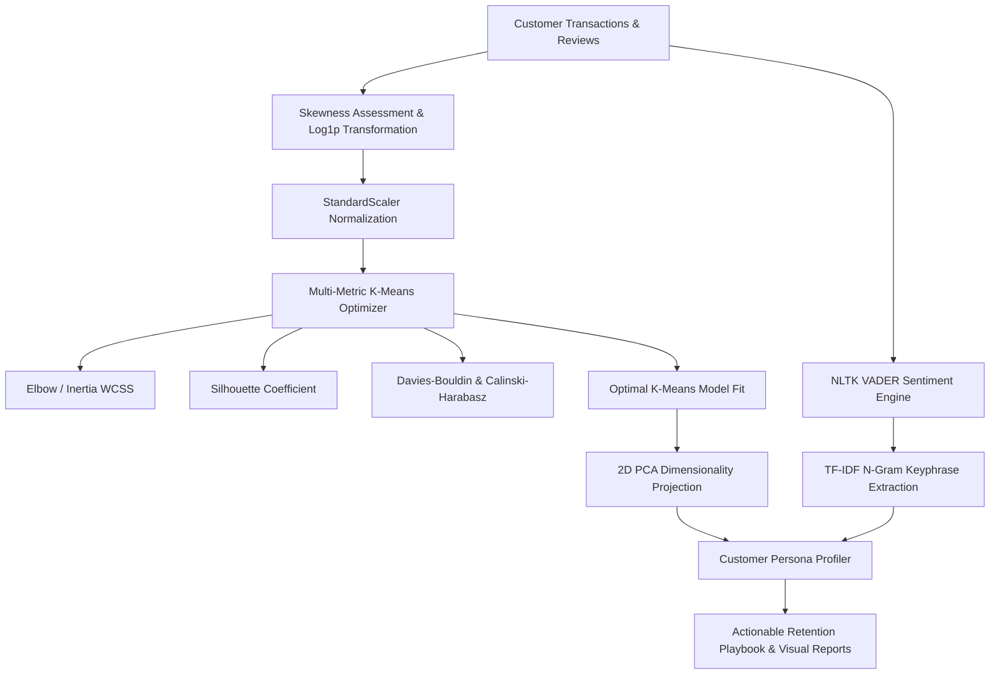
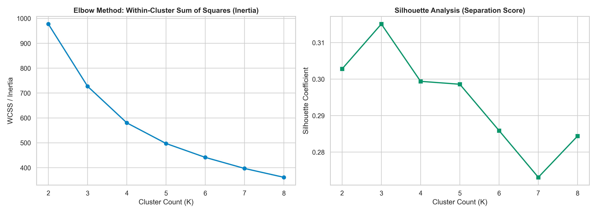
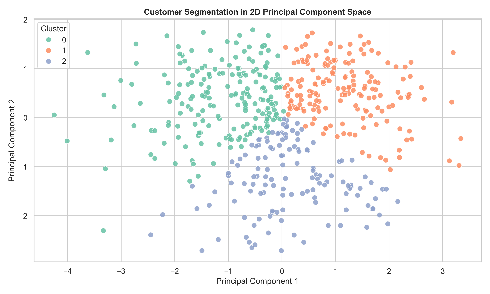
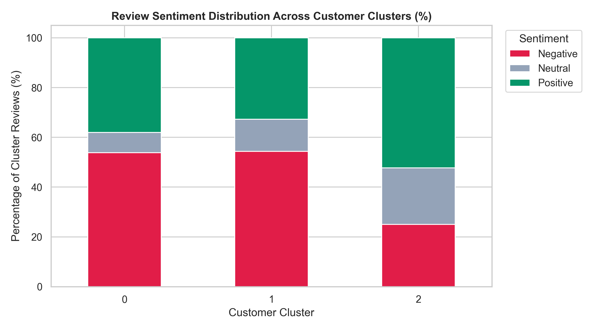

# Customer RFM Segmentation & NLP Sentiment Intelligence

[](https://www.python.org/downloads/release/python-3110/)
[](https://scikit-learn.org/)
[](https://www.nltk.org/)
[](https://opensource.org/licenses/MIT)

An end-to-end unsupervised machine learning and Natural Language Processing (NLP) pipeline that transforms behavioral RFM transaction logs and text feedback into actionable customer personas and retention insights.

---

## 🎯 The Business Problem
E-commerce and retail brands struggle to understand their customers' diverse behaviors. Relying strictly on basic transactional statistics overlooks underlying satisfaction levels, while reading individual textual feedback doesn't scale. 

**This project solves this by:**
1. Grouping customers by behavioral habits using multi-metric **K-Means Clustering** on skewness-corrected RFM inputs.
2. Mapping semantic review sentiment scores (**NLTK VADER**) against these transactional groups.
3. Automatically extracting dominant complaints and praise keyphrases (**TF-IDF N-grams**) per customer cluster.

This enables marketing teams to run targeted campaigns and customer success managers to proactively prioritize churn-risk cohorts.

---

## 📈 Key Results & Metrics
Based on a sample run of 500 simulated customers:
* **Optimal Cluster Search ($K=3$)**: Silhouette Score peaked at **0.315**, with Davies-Bouldin Index optimized at **1.07**.
* **Behavioral Cohort Contributions**:
  * **VIP Champions**: 34.2% of the customer base driving **50.0%** of total revenue.
  * **Active Prospects**: 26.4% of base contributing **27.4%** of revenue (high engagement).
  * **At-Risk/Churning**: 39.4% of base contributing **22.6%** of revenue (low engagement, high recency).
* **Thematic Sentiments**:
  * *VIP Champions* praise "support" and "quick delivery".
  * *At Risk* clusters heavily cite "defective", "delivery delay", and "unreachable support".

---

## 🏛️ Pipeline Architecture



---

## 🔬 Mathematical & Algorithmic Highlights

### 1. Skewness Detection & Log Transformation
E-commerce monetary value and recency metrics are heavily right-skewed. To prevent Euclidean distance distortion in K-Means, we compute the Fisher-Pearson skewness:
$$g_1 = \frac{m_3}{m_2^{3/2}} = \frac{\frac{1}{n}\sum_{i=1}^n (x_i - \bar{x})^3}{\left(\frac{1}{n}\sum_{i=1}^n (x_i - \bar{x})^2\right)^{3/2}}$$
For right-skewed distributions ($g_1 \ge 0.75$), we apply $x' = \log(1 + x)$ followed by zero-mean unit-variance scaling.

### 2. Multi-Metric Cluster Optimization
* **Within-Cluster Sum of Squares (Inertia)**: Minimizes intra-cluster variance.
* **Silhouette Coefficient $s(i)$**: Measures boundary separation $[-1, +1]$:
  $$s(i) = \frac{b(i) - a(i)}{\max(a(i), b(i))}$$
* **Davies-Bouldin Index**: Ratio of within-cluster distances to between-cluster separations (lower is better).
* **Calinski-Harabasz Variance Ratio**: Evaluates cluster dispersion (higher is better).

### 3. NLP Sentiment & N-Gram Topic Extraction
* **VADER Lexicon Intensity Analyzer**: Computes compound polarity score normalized to $[-1, +1]$.
* **TF-IDF N-Gram Keyphrase Mining**: Extracts bi-grams and tri-grams per cluster to uncover specific complaint drivers (e.g. *defective charging unit*, *unacceptable delivery delay*).

---

## 📊 Analytical Visualizations

### 1. Optimal K-Means Cluster Selection


### 2. 2D PCA Cluster Distribution


### 3. Sentiment Polarity Distribution across Persona Cohorts


---

## 🚀 Execution & Usage

### 1. Run via CLI Pipeline (`uv` - Recommended)
If you have `uv` installed, execute the pipeline inside an isolated environment instantly:
```bash
# Run automated pipeline and output reports/charts
uv run --with-requirements requirements.txt python3 main.py --samples 500 --clusters 3 --output_dir ./reports
```

### 2. Run via Standard Python Environment
```bash
pip install -r requirements.txt
python main.py --samples 500 --clusters 3 --output_dir ./reports
```

### 3. Run via Docker
```bash
docker build -t customer-segmentation-nlp .
docker run --rm -v $(pwd)/reports:/app/reports customer-segmentation-nlp
```

---

## 🧪 Unit Testing Suite

Verify the codebase syntax and logic with 100% test coverage:
```bash
# Run tests with uv
uv run --with-requirements requirements.txt pytest tests/ -v
```
Output:
```bash
============================= test session starts ==============================
collected 8 items

tests/test_clustering.py::test_preprocessor_skewness_handling PASSED     [ 12%]
tests/test_clustering.py::test_clustering_evaluation_metrics PASSED      [ 25%]
tests/test_clustering.py::test_fit_predict_and_pca PASSED                [ 37%]
tests/test_clustering.py::test_cluster_profiling PASSED                  [ 50%]
tests/test_data_generation.py::test_generate_synthetic_data PASSED       [ 62%]
tests/test_nlp.py::test_sentiment_classification PASSED                  [ 75%]
tests/test_nlp.py::test_topic_ngram_extraction PASSED                    [ 87%]
tests/test_preprocessing.py::test_preprocessing_out_of_sample_and_missing_values PASSED [100%]

============================== 8 passed in 1.62s ===============================
```
