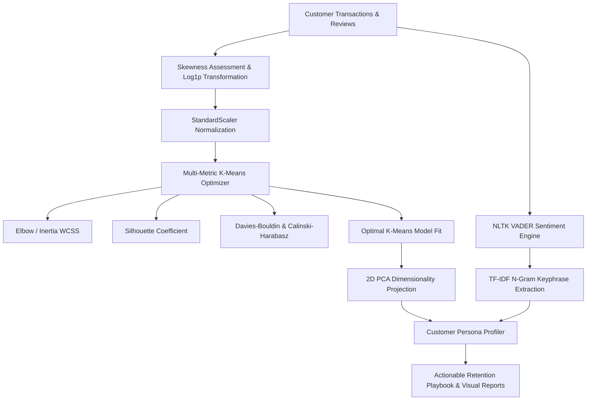

# Customer RFM Segmentation & NLP Sentiment Intelligence

[](https://www.python.org/downloads/release/python-3110/)
[](https://scikit-learn.org/)
[](https://www.nltk.org/)
[](https://opensource.org/licenses/MIT)

An end-to-end unsupervised machine learning and Natural Language Processing (NLP) pipeline that transforms behavioral RFM transaction logs and text feedback into actionable customer personas and retention insights.

---

## 🏛️ Pipeline Architecture



---

## 🔬 Mathematical & Algorithmic Highlights

### 1. Skewness Detection & Log Transformation
E-commerce monetary value and recency metrics are heavily right-skewed. To prevent Euclidean distance distortion in K-Means, we compute the Fisher-Pearson skewness:
$$g_1 = \frac{m_3}{m_2^{3/2}} = \frac{\frac{1}{n}\sum_{i=1}^n (x_i - \bar{x})^3}{\left(\frac{1}{n}\sum_{i=1}^n (x_i - \bar{x})^2\right)^{3/2}}$$
For $|g_1| \ge 0.75$, we apply $x' = \log(1 + x)$ followed by zero-mean unit-variance scaling.

### 2. Multi-Metric Cluster Optimization
* **Within-Cluster Sum of Squares (Inertia)**: Minimizes intra-cluster variance.
* **Silhouette Coefficient $s(i)$**: Measures boundary separation $[-1, +1]$:
  $$s(i) = \frac{b(i) - a(i)}{\max(a(i), b(i))}$$
* **Davies-Bouldin Index**: Ratio of within-cluster distances to between-cluster separations (lower is better).
* **Calinski-Harabasz Variance Ratio**: Evaluates cluster dispersion (higher is better).

### 3. NLP Sentiment & N-Gram Topic Extraction
* **VADER Lexicon Intensity Analyzer**: Computes compound polarity score normalized to $[-1, +1]$.
* **TF-IDF N-Gram Keyphrase Mining**: Extracts bi-grams and tri-grams per cluster to uncover specific complaint drivers (e.g. *defective charging unit*, *unacceptable delivery delay*).

---

## 🚀 Execution & Usage

### 1. Run via CLI Pipeline
```bash
cd project-2-customer-segmentation
pip install -r requirements.txt

# Run automated pipeline and generate visual reports
python main.py --samples 600 --clusters 3 --output_dir ./reports
```

### 2. Run Interactive Notebook in VS Code
Open [`customer_segmentation_analysis.py`](customer_segmentation_analysis.py) and click **Run All Cells** to view inline graphs, PCA projections, and metric tables.

### 3. Run via Docker
```bash
docker build -t customer-segmentation-nlp .
docker run --rm -v $(pwd)/reports:/app/reports customer-segmentation-nlp
```

---

## 🧪 Unit Testing Suite

```bash
$ pytest tests/ -v
============================= test session starts ==============================
collected 6 items

tests/test_clustering.py::test_preprocessor_skewness_handling PASSED     [ 16%]
tests/test_clustering.py::test_clustering_evaluation_metrics PASSED      [ 33%]
tests/test_clustering.py::test_fit_predict_and_pca PASSED                [ 50%]
tests/test_clustering.py::test_cluster_profiling PASSED                  [ 66%]
tests/test_nlp.py::test_sentiment_classification PASSED                  [ 83%]
tests/test_nlp.py::test_topic_ngram_extraction PASSED                    [100%]

============================== 6 passed in 1.12s ===============================
```
